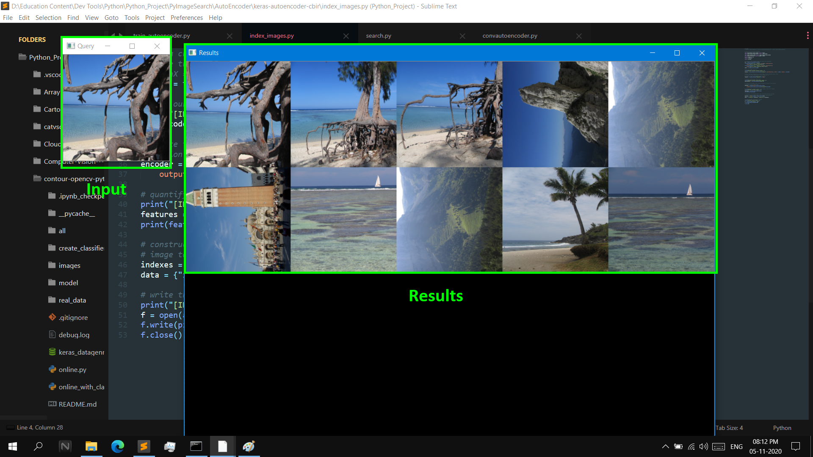

## Autoencoder based Image search engine in python

#### Requirments
* Python >= 3.6
* Keras 2.4
* Tensorflow >= 2 (Use tensoflow-gpu version for faster training)
* Dataset: https://www.kaggle.com/ponrajsubramaniian/vacational-places-image-dataset (You can use your own image data)

##### For more detail refer the below URL:
https://www.pyimagesearch.com/2020/02/17/autoencoders-with-keras-tensorflow-and-deep-learning/
##### Note:
      commands to execute the file is mentioned in the python files itself.
##### Execute the files one by one as mentioned below
1. train_autoencoder.py
2. index_images.py
3. search.py

##### Result

